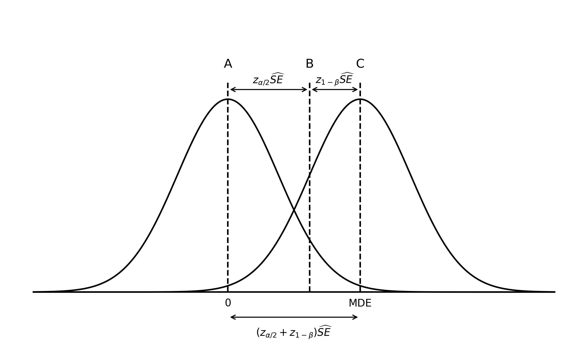

# Power {#sec-power}

## What is power and how do we measure it?

Power is the probability of finding a significant results (and thus rejecting the null hypothesis) when it is false. 
$$
P(\text{significant result} | H_0\text{ false}).
$$
In the context of online experiments, we usually measure power in terms of the **minimum detectable effect** (MDE) as proposed in @bloom1995minimum. The author defines the MDE as:

> The minimum detectable effect of an experiment is the smallest effect that, if true, has an X% chance of producing an impact estimate that is statistically significant at the Y level.
> 
X is the statistical power of the experiment for an alternative hypothesis equal to the minimum detectable effect. Y is the level of statistical significance used to decide whether or not a true effect exists.

In [our context](hypothesis_testing.md#types-of-errors) we have $X=1-\beta$ and $Y=\alpha$.

When we say that we perform "power calculations" or "sample size calculations", we do two things: we calculate the number of units we need in our experiments and then estimate how long it will take us to collect this many units. The first step makes use of a version of the following formula (e.g. [here](https://docs.statsig.com/experiments-plus/power-analysis/#calculation-details)):

$$
n_v = 2(z_{\alpha/2} + z_{1 - \beta})^2\frac{s^2}{\Delta^2}.
$${#eq-sampsi}

This formula can be intimidating and confusing, all the more so since there are different and sometimes incorrect versions presented in different articles. In this section, I want to derive and explain the formula to demystify it.

## Deriving the power formula

There are three ways to derive the formula. Two heuristic approaches and one approach that starts from first principles. All three can help us understand what we are doing more deeply.

### Bloom approach[^2]

From the definition above, we know that power is defined for an alternative hypothesis equal to the MDE. If we perform a two-sided test, we thus test the hypothesis:

$$
\begin{align}
&H_0: \tau = 0 \\[5 pt]
&H_A: \tau = |\Delta|,
\end{align}
$$

where $\Delta$ is the MDE and where we use the absolute value to allow for negative or positive effects, given that we perform a two-sided test. 

From our hypothesis testing procedure we know that we'll reject $H_0$ in a two-sided test on the upper tail if the test statistic $t=\frac{\hat{\tau}^{\text{dm}}}{\widehat{SE}}$ falls to the right of the upper-tail critical value $z_{\alpha/2}$, that is if $|t| \geq z_{\alpha/2}$.

In the figure below, this means we reject H_0 if t falls to the right of vertical line B.

Remember that above, we defined power as the probability that we will reject H_0 if the true effect equals the MDE. This means that we need 1-beta of the mass of the HA distribution to the right of z_alpha/2. in figure below, this means to the right of line B. This is what we can see.

We know that under the h0 distribution, the distance from A to B is z_alpha/2 SE. In the Ha distribution, the distance from B to C is z_1-beta SE.

Hence, together we get 
$$
\Delta = (z_{\alpha/2} + z_{1-\beta})\widehat{SE}
$$

Given our hypothesis testing procedure we know that in a two-sided test, we reject $H_0$ if the test statistic

Let's start by understanding @fig-power, which visualises the setup of a
one-sided hypothesis test where the true effect equals 0 under the null
hypothesis and some positive constant $\te$ under the alternative hypothesis. Note that the curves are *not* the standard normal distribution,
but the sampling distribution of our estimator $\tee$. This means that the standard
deviation of the curves is given by the standard error of $\tee$, which is
$\se$. 
the distribution will be the same under both the null and the alternative
hypothesis, with the center of each distribution given by our hypothesised value
of $\te$ -- zero under $\hn$ and a positive constant under $\ha$.

We reject $\hn$ if $\tee$ is to the right of the critical value $\za$. Also,
for a given level of power $\beta$, 

For significance level $\alpha$, the critical value $z_{a/2}$ in a two-sided test is the point of the standard normal distribution under $H_0$ that has $\alpha/2$ of the probability mass to its right. 

We reject the null hypothesis if the test statistic falls to the right of that value. 

Similarly, for a given level of power, $1-\beta$, the critical value $z_{1-\beta}$ is the point of the standard normal distribution under $H_A$ that has $1-\beta$ of the probability mass to its right. 

**this is a mess still **

Figure @fig-power shows the sampling distribution of $\hat{\tau}^{\text{dm}}$ under the null hypothesis centered around zero (vertical line A) and the alternative hypothesis centered around the MDE (vertical line C). 

If we perform a two-sided hypothesis test with significance level $\alpha$ we will reject the null hypothesis on the upper tail if the test statistic is larger than $z_{\alpha/2}\widehat{SE}$ (vertical line B). If the true effect equals the MDE, and we define the MDE as the true positive impact given $1-\beta$ power and given our significance level $\alpha$, then $1-\beta$ of the mass of its sampling distribution must lie to the right of line B. Why? Because this ensures that we reject $H_0$ $1-\beta$ percent of the time. 

If we define MDE = $\Delta$ we then have, in general:
$$
\Delta = (z_{\alpha/2} + z_{1-\beta})\widehat{SE}
$$

{#fig-power}

Numeric example
$\alpha = 0.05$ 
than 1.96$\widehat{SE}$ (vertical line B). If the true effect equals the MDE, and we define the MDE as the the true positive impact given 80% power (the conventional choice) and our significance level, then 80% of the mass of its sampling distribution must lie to the right of line B. This implies that the MDE is 0.84$\widehat{SE}$ above line B.

Together, this implies that for any two-sided hypothesis test of zero impact with 80% power and a 5% significance level, the MDE will always equal 2.8$\widehat{SE}$.

### Two-equations approach[^4]

Collecting the "required" sample size ensures that (over the course of many experiments), our [Type I error rate](hypothesis_testing.md#types-of-errors) equals $\alpha$ and our [Type II error rate](hypothesis_testing.md#types-of-errors) equals $\beta$. Instead of directly thinking about the type II error rate, we usually think about it's [complement](hypothesis_testing.md#types-of-errors), power, given by $1-\beta$.

Using the definition of the MDE above, we know that power is defined for an alternative hypothesis equal to the MDE. If we perform a two-sided test, we thus test the hypothesis:

$$
\begin{align}
&H_0: \tau = 0 \\[5 pt]
&H_A: \tau = |\Delta|.
\end{align}
$$

Given our [hypothesis testing procedure](hypothesis_testing.md#basic-approach), ensuring a Type I error that equals $\alpha$ in a two-sided test requires that:

$$
\frac{\hat{\tau}^{\text{dm}}}{\widehat{SE}}
= z_{\alpha/2}.
$${#eq-type1}

Similarly, ensuring a level of power of $1-\beta$ in a one-sided test requires that:

$$
\frac{\hat{\tau}^{\text{dm}}- \Delta}{\widehat{SE}}
= z_{1-\beta}.
$${#eq-type2}

Combining both conditions by rearranging @eq-type1 for $\hat{\tau}^\text{dm}$ and substituting that term in @eq-type2 we get the desired condition:
$$
\begin{align}
\frac{\widehat{SE}z_{\alpha/2} - \Delta}{\widehat{SE}} &= z_{1-\beta} \\[6pt]
\widehat{SE}z_{\alpha/2} - \Delta &= \widehat{SE}z_{1-\beta} \\[6pt]
\widehat{SE}z_{\alpha/2} + \widehat{SE}z_{1-\beta}  &= \Delta \\[6pt]
\widehat{SE}\left(z_{\alpha/2} + z_{1-\beta}\right)  &= \Delta.
\end{align}
$$

### First-principles approach

Power is the probability that we reject the null hypothesis if there exists a true effect of size $\Delta$. 

We thus have, for a two-sided hypothesis test:
$$
\begin{align}
&H_0: \tau = 0 \\[5 pt]
&H_A: \tau = |\Delta|.
\end{align}
$$

We test the null hypothesis by constructing the test statistic
$$
t = 
\frac{\hat{\tau}^{\text{dm}}}
{\widehat{SE}},
$$

and reject $H_0$ if if falls into the rejection region beyond the critical value $z_{\alpha/2}$. Because the standard normal distribution is symmetric, for a two-sided test we thus reject $t$ if
$$
\begin{align}
|t| &> z_{\alpha/2} \\[5pt]

\left|\frac{\hat{\tau}^{\text{dm}}}{\widehat{SE}}\right| 
&> z_{\alpha/2} \\[5pt]

\left|\hat{\tau}^{\text{dm}}\right| 
&> z_{\alpha/2}\widehat{SE}.
\end{align}
$$

The power $1-\beta$ of the test under $H_A$ is the probability that the test statistic $t$ falls into the rejection region, which is:
$$
1 - \beta = P\left[
\left|\hat{\tau}^{\text{dm}}\right| 
> z_{\alpha/2}\widehat{SE}
\>\middle|\> H_A
\right].
$$

The test statistic falling into the lower or upper rejection region are mutually exclusive events, so the above is equal to
$$
1 - \beta 
= P\left[
\hat{\tau}^{\text{dm}} 
> z_{\alpha/2}\widehat{SE}\>\middle|\> H_A
\right]
+ P\left[
\hat{\tau}^{\text{dm}} 
< -z_{\alpha/2}\widehat{SE}\>\middle|\> H_A
\right]
$$

We can calculate these probabilities by standardising, which gives us: 

$$
\begin{align}
1 - \beta 
&= P\left[
\frac{\hat{\tau}^{\text{dm}} - \Delta}{\widehat{SE}}
>
\frac{z_{\alpha/2}\widehat{SE} - \Delta}{\widehat{SE}}
\right]

+ P\left[
\frac{\hat{\tau}^{\text{dm}} - \Delta}{\widehat{SE}}
<
\frac{-z_{\alpha/2}\widehat{SE} - \Delta}{\widehat{SE}}
\right]

\\[5pt]

&=
P\left[t > \frac{z_{\alpha/2}\widehat{SE} - \Delta}{\widehat{SE}}
\right]

+ P\left[t < \frac{-z_{\alpha/2}\widehat{SE} - \Delta}{\widehat{SE}}
\right]

\\[5pt]

&=
P\left[t > z_{\alpha/2} - \frac{\Delta}{\widehat{SE}}
\right]

+ P\left[t < - z_{\alpha/2} - \frac{\Delta}{\widehat{SE}}
\right].
\end{align}
$$

Using the standard normal CDF, $\Phi(z)$, we get:

$$
\begin{align}
1 - \beta 
=1 - \Phi\left(z_{\alpha/2} - \frac{\Delta}{\widehat{SE}}\right)
+ \Phi\left(- z_{\alpha/2} - \frac{\Delta}{\widehat{SE}}\right).
\end{align}
$$

The probability that we reject the null hypothesis for the wrong reason, because the test statistic falls below the lower critical value for a true positive effect or above the upper critical value for a true negative effect, is very small.[^3] Hence, as the true effect size deviates from zero, one of the two terms in the expression above becomes vanishingly small and can be ignored. For the rest of this chapter, I assume we have a true positive effect and omit the second of the two terms above. We thus have:

$$
1 - \beta = 
1 - \Phi\left(z_{\alpha/2} - \frac{\Delta}{\widehat{SE}}\right).
$$

Using the symmetry of the standard normal distribution, which implies that $1 - \Phi(k) = \Phi(-k)$, we can simplify this to

$$
\begin{align}
1 - \beta 
= 
\Phi\left(\frac{\Delta}{\widehat{SE}} - z_{\alpha/2}\right).
\end{align}
$${#eq-power}

Next, remember that $\Phi(z)$ takes z-values and returns probabilities (the probability that a standard normal variable is less than a given z value). The inverse, $\Phi^{-1}(p)$, thus takes probabilities and returns z-values (the $z$ value with $p$ probability mass to its left). Hence, $\Phi^{-1}(1-\beta)$ refers to the upper-tail critical value of the standard normal distribution that has $1-\beta$ probability mass to its right, and which we defined above as $z_{1-\beta}$. Using this, we get:

$$
\begin{align}

\Phi^{-1}(1 - \beta)
&= 
\Phi^{-1}\left(
\Phi\left(\frac{\Delta}{\widehat{SE}} - z_{\alpha/2}\right)
\right) \\[5pt]

z_{1-\beta}
&= 
\frac{\Delta}{\widehat{SE}} - z_{\alpha/2} \\[5pt]
\end{align}
$${#eq-mde}

Rearranging, we get:

$$
\Delta = \widehat{SE}\left(z_{\alpha/2} + z_{1-\beta}\right).
$$

**this bit below is gonna be useful for all three approaches – they all end up with the above expression**

Depending on the context, we can plug in any of the standard error versions [we defined earlier](stats_of_online_experiments#standard_error). To arrive at the above version, we use @eq-se-equal, which gives us:

$$
\begin{align}

\Delta
&= \widehat{SE}\left(z_{\alpha/2} + z_{1-\beta}\right) \\[5pt]

\Delta
&= \sqrt{\frac{2s^2}{n_v}}\left(z_{\alpha/2} + z_{1-\beta}\right) \\[5pt]

\Delta^2
&= \frac{2s^2}{n_v}\left(z_{\alpha/2} + z_{1-\beta}\right)^2 \\[5pt]

n_v
&= 2\left(z_{\alpha/2} + z_{1-\beta}\right)^2\frac{s^2}{\Delta^2}
\end{align}
$$

If, instead of using @eq-se-equal we use the standard error expressed in terms of sample proportions from @eq-se-prop, we get:
$$
\begin{align}
n &= \frac{(z_{\alpha/2} + z_{1-\beta})^2}{p(1-p)} \frac{s^2}{\Delta^2},
\end{align}
$$
where the left-hand side, $n$ now refers to the total sample size in the experiment rather than the sample size per variant.

## Required sample size

The required sample size is determined by four factors:

1. The probability of making a [Type I error](hypothesis_testing$types_of_errors), denoted by $\alpha$, corresponds to the significance level of the test and has an associated with the upper-tail critical value $z_{\alpha/2}$ in a two-sided test.

2. The probability of making a [Type II error](hypothesis_testing$types_of_errors), denoted by $\beta$, determines the power of the test, $1-\beta$, and has associated critical value given by $z_{1 - \beta}$.

3. The standard deviation of the outcome variable, $s$.

4. The minimal detectable effect size, $\Delta$.

In the context of online experiments, we usually fix the significance level and desired power, calculate the estimate the outcome variable's standard deviation from historical data, fix the minimal detectable effect, and then calculate required sample size. Given these inputs, and  [assuming equal sample sizes and variances](stats_of_online_experiments#standard_error) for treatment and control variants, that required sample size per variant is given by:
$$
\begin{align}
n_v = 2(z_{\alpha/2} + z_{1 - \beta})^2\frac{s^2}{\Delta^2},
\end{align}
$$ {#eq-sampsi}

## Relative effects

See zhou2023all, also Statsig docs

## Correlated data

See zhou2023all, hesterberg2024power

## Effective sample size of test

### Effective Sample Size in a Two-Sample Test (Equal Variances Assumed)

When comparing two groups — treatment (size $N_T$) and control (size $N_C$) — and assuming equal variances, the effective sample size for estimating the variance of the difference in means is given by the harmonic mean:

$$
N_{\text{eff}} = \frac{1}{\frac{1}{N_T} + \frac{1}{N_C}}
$$

This arises because the variance of the difference in means is:

$$
\text{Var}(\bar{Y}_T - \bar{Y}_C) = \sigma^2 \left( \frac{1}{N_T} + \frac{1}{N_C} \right)
$$

If we treat this as equivalent to the variance under a single sample of size $N_{\text{eff}}$, then:

$$
\text{Var}(\text{difference}) = \frac{2\sigma^2}{N_{\text{eff}}}
$$

Matching both sides gives the harmonic mean as the effective sample size.

### Interpretation

- The harmonic mean weights smaller group sizes more heavily.
- It reflects the information content for estimating differences — imbalanced samples reduce power.

## Rule of thumb

Blog post on 16 or 32 power confusion:
- Reliably looking posts who get it wrong: (https://towardsdatascience.com/probing-into-minimum-sample-size-formula-derivation-and-usage-8db9a556280b --- starts with the wrong std error with N for total instead of variant sample size), there is also Kohavi book or paper that gets it wrong

- There is another way to express the variance, which has led to massive
confusion.

- I'm pretty sure its the 1/N vs 1/(N/2) error that accounts for the wrong
result, and nobody seems to derive this from first principles to check.

- Is original wrong? Check in book -- access through WBS.

Popular experiment textbooks and countless sources on the internet often refer to the rule-of thumb for the total sample size calculation that is given by:

$$
\N \approx \frac{32\vpe}{\tee^2}.
$$

Using formula XXX we can see that the rule of thumb straightforwardly results from using the default parameters.

Assuming equal sample size, so that $P=0.5$ gives us

$$
N = 4 (z_{1 - \beta} + z_{\alpha/2})^2\left(\frac{\sev}{\te}\right)^2.
$$

Setting the false positive rate to 5% and the false negative rate at 20% for a two-sided hypothesis test, as we commonly do, we get

$$
\begin{align}
N &= 4 (0.84 + 1.96)^2\left(\frac{\sev}{\te}\right)^2 \\
&\approx \left(\frac{32\sev}{\te}\right)^2
\end{align}
$$

Give also per variant, as this is more useful to calculate sample size for experiments with n arms. 

## How to choose key parameters

### MDE

- What are you balancing here? The size of the effect you are able to identify and the time it takes to do it.

- All else equal, the smaller a change you want to be able to detect, the longer it will take for the experiment to run because you need more sample size.

- The relevant question to ask here is "what counts as a practically relevant change?"

- To answer that, consider:

  - Maturity of service (the more mature, the smaller a change can be expected)

  - Size of service (the larger, the smaller a change still generates a lot of revenue)

  - Cost of change that need ot be covered

    - Cost of fully building out feature for launch (can be 0 when fully built out for experiment or high if we use painted door)

    - Cost of maintaining new code (new code has higher bugs, may increase code complexity and maintenance)

    - Other costs: e.g. does CPU utilization increase?

### Significance level

- What are you balancing here? The probabilities of making a type I and type II error.

- The higher significance level, the less likely we are to implement useless features (to make a Type I error) but the more likely we are to no implement useful features (to make a Type II error).

- Hence, gotta balance cost of implementing useless feature and cost of not implementing useful feature.

- Things that play into this:

  - How long will feature be in effect (less long lowers risk of implementing)?

  - How widely will it be deployed (less widely lowers risk of implementing)?

  - How many users will see it / where in the funnel is it (later in funnel lowers risk of implementation)

- What to do in practice:

    - Start from baseline values ($alpha = 0.05$)

    - Adjust depending on balance of risks

### Power

- What are you balancing here? The risk of making a Type II error and the time you have to wait for your results.

- All else equal, the higher a level or power you want, the longer you'll have to run the experiment to accumulate the requried sample size.

- Factors to consider:

  - How costly is it to not implement a useful feature.

## What determines power

- Significance level

- Effect size

- Standard error

    - Sample size

    - Variant allocation proportion

    - Metric variance

## How to increase power

- for framing on how to increase power, Integrate larsen2023statistical section 2

- Power can be increased trivially by lowering the significance level, which we often don't want to do, or by increasing sample size, which we're often trying to avoid.

- Increase effect size

  - Ensure that only users who are exposed to the change are in the data to avoid dilution of the effect

- Optimally allocate variance proportions

  - Usually equal for highest power

  - Show why with many treatment variants, higher share in control is better

- Reduce metric variance
	- Choose metric with low variance
		- Indicator variables
		- Avoid count variables which have have increasing variance as experiment duration progresses
	- Use variance reduction technique
	- Trim outliers
	- Only include triggered users

- Use a one-sided test

	Effect of one-sided testing on required sample size.
	
	In general:
	$$
	N =  \frac{(t_a + t_{1-\kappa})^2}{P(1-P)}\left(\frac{\sigma}{\delta}\right)^2
	$$
	
	For $\alpha = 0.05$, we have $t_{\alpha}^{ts} = 1.96$ and $t_{\alpha}^{os} = 1.65$, while for $\kappa = 0.8$ we have $t_{1 - \kappa} = 0.84$. Hence:
	$$
	\frac{N^{os}}{N^{ts}} = \frac{ (1.64 + 0.84)^2}{(1.96 + 0.84)^2} = \frac{6.2}{7.84} = 0.79
	$$
	
	Hence, for given levels of power and significance, a one-sided test requires about 21 percent fewer observations.
	

## Problems with low power

- Truth inflation: underpowered studies only find a significant effect it the effect size is larger than the true effect size, leading to inflated claims of effect sizes.

## Power in online experiments

- @kohavi2014seven point out (in rule 7) that while general advice suggets that the CLT provides a good approximation for n larger than 30, the large skew in online metrics often requires many moer users. They recomment 355 * (skewness coefficient)^2.

The theory for power calculation was developed for metrics with fixed values such as hight or weight.

- (During an experiment, the treatment will still change the metric values, but in practice we often make the sensible assumption that the treatment effect will be small, so that the variance between treatment and control are the same. This, in turn, then justifies use of pre-experiment data under the assumption that pre-experiment and experiment data will be very similar.)

- In online experiments, we often experiment with metrics that are only defined for a specific period of time (e.g. conversion during a 1-month period starting on 15 March 2024).

- This makes power calculation more complicated.

- When calculating required sample size (and/or experiment duration) for an experiment we want to make sure that a Z-test performed at the end of the experiment with the required number of unique units has a certain pre-specified level of power.

- To calculate that required sample size we input a baseline metric value and the metric standard deviation.

- With metrics defined only for specific periods, how to calculate these two values is not straightforward.

- Let's see what we generally do when a metric value is fixed. 

- Actually, writing this and thinking of an example for the above makes me think that this might be an issue inherent to causal inference analysis. 

- An example where we don't have the problem is if we want to compare the height of Londoners to the height of Berliners. Here, we'd do the following:

	- Draw a random sample of Londoners and measure mean and variance of their heights.
	- Do the same for a random sample of Berliners.
	- Perform a Z-test and calculate its power.

- Writing the above makes me realise that the issue is inherent in ex-ante power calculations:
	- Even in the Londoners and Berliners height example above we'd run into the same problem if we wanted to calculate, before taking any samples, how many samples we'd have to take to have our Z-test be adequately powered.

- The problem arises once we rearrange the power formula from

$$
1 - \beta = f(\sigma^2, \delta, P, z_\alpha, z_{1-\beta})
$$
to
$$
N = \frac{z_\alpha + z_{1-\beta}}{P(1-P)}\frac{\sigma^2}{\delta^2}
$$
- Because we would use the first version at the time we perform the analysis when we have all the required inputs, whereas we perform the second one before the analysis when we have to estimate $\sigma$ and $\delta$.

- The core of the problem is that for many online experiment metrics baseline metric mean and variance change depending on (1) the size of the sample they are calculated from and (2) the period of time and period location they are calculated based on.

- (1) is always the case, even in the Londoners and Berliners example above. It's inherent in performing power calculations.

- (2) is an additional complications in many online experiments. The two components are period length and period location (i.e. do we measure period of length $t$ in January of September).

- Outside of periods that are non-representative because of seasonality reasons, ignoring period location should usually not be a big problem.

- However, period duration might make a difference.

- So, the core problem is that in online experiments, in addition to approximating the sample we calculate metrics based on we also have to approximate the time period.

- How big a difference does calculating means and stds based on different time periods make? The difference can be substantial. The below table shows means and std for order visit conversion for a set of UK users based on different period lengths.

![[order-conversion-visit-different-periods.png|300]]

- Required sample size is directly proportional to the sample variance, which means that using the variance based on one week instead of 1 month of data would increase required sample size by a factor of $\frac{0.36^2}{0.31^2} = 1.35$.

- How hard is it to decently estimate an appropriate time-period? There are two parts we have to estimate: required number of unique units, and how long it takes to gather data from these many units.

- The required number of units is determined by:
	- Metric value mean (for experiment-period-length long period)
	- Metric value variance (for experiment-period-length long period)

- To amount of time it takes us to gather data for the required number of units depends on traffic to the precise point of the user-funnel/app where the bucketing for the experiment takes place.

Solution:
- To ensure that analysis is correctly powered, calculate power every day and stop once adequately powered.
- If you want ex-ante guidance, use sensible approximations.

- First best: to know when analysis is sufficiently powered, calculate power daily and stop experiment when required level of power reached. This ensures that we have both (1) sample we use for analysis and (2) period used for analysis.

- Second best, if we performed power using data from, say, the first 7-days of the experiment period, we would have a subset of (1) and could intelligently estimate (2) because the observed traffic would take into account the bucketing point and we could estimate future traffic based on it (e.g. we can estimate unique user visits based on unique visits during first week, with different traffic being the result of different bucketing points, but we can estimate path for all bucketing points).

- Third best, if we want to perform power calculation before the experiment starts (i.e. because we want to provide duration estimate during experiment config), we could use data from recent history (e.g. calculated monthly), and calculated separately for each metric, market, and based on other relevant dimensions such as different time period. Though, here, taking into account bucketing points might be challenging and hard to scale. So think about good approximations.

## Best practices

- When aiming to estimate a precise effect size rather than just being interested in statistical significance, use assurance instead of power: instead of choosing a sample size to attain a given level of power, choose sample size so that confidence interval will be suitably narrow 99 percent of the time ([Sample-Size Planning for More Accurate Statistical Power: A Method Adjusting Sample Effect Sizes for Publication Bias and Uncertainty](https://www3.nd.edu/~kkelley/publications/articles/Anderson_Kelley_Maxwell_Psychological_Science_2017.pdf) and [Understanding the new statistics](https://tandfbis.s3.amazonaws.com/rt-media/pp/common/sample-chapters/9780415879682.pdf).)

## Experiment duration

- We usually care about power because it determines experiment runtime.

- There we walk about how to translate required N into runtime.

- [Simon Johnson -- Four Customer Characteristics That Should Change Your Experiment Runtime](https://www.geteppo.com/blog/four-customer-characteristics-that-should-change-your-experiment-runtime)

## Useful resources

- @larsen2023statistical for general overview
- @zhou2023all for comprehensive overview of how to calculate power
- @bojinov2023design, section 5, for simulation results for switchbacks and generally good approach to simulation to emulate
- @reich2012empirical power calcs for cluster-randomised experiments

- [Power Analysis for Experiments with Clustered Data, Ratio Metrics, and Regression for Covariate Adjustment](https://arxiv.org/pdf/2406.06834)

- [Statsig sample size calculation formula](https://www.statsig.com/blog/calculating-sample-sizes-for-ab-tests?utm_id=ZmFiaWFuLmd1bnppbmdlckBqdXN0ZWF0dGFrZWF3YXkuY29t&k_is=opl)

[^mutuallyexcl]: We can simply dd up the probability of the test statistic falling into the
upper and lower tail because the two events are independent.

[^1]: I say "often" [sequential testing approaches](https://docs.geteppo.com/statistics/confidence-intervals/analysis-methods/) do not require ex-ante power calculations. 

[^2]: This section summarises the approach presented in @bloom1995minimum. 

[^3]: This type of error is sometimes called a [Type III error](https://en.wikipedia.org/wiki/Type_III_error).

[^4]: This section is based on @list2011so.
